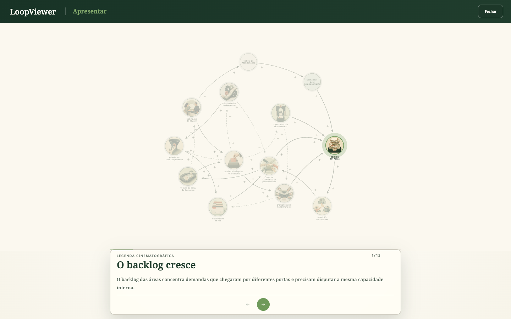
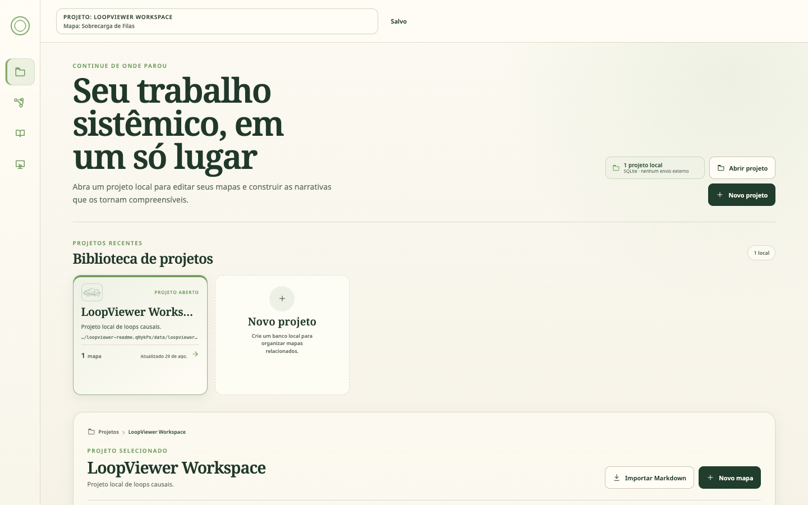
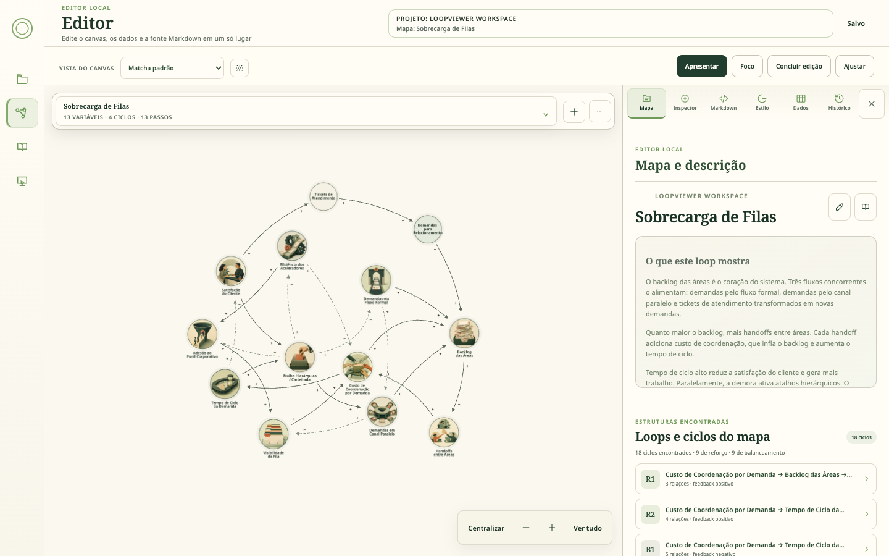
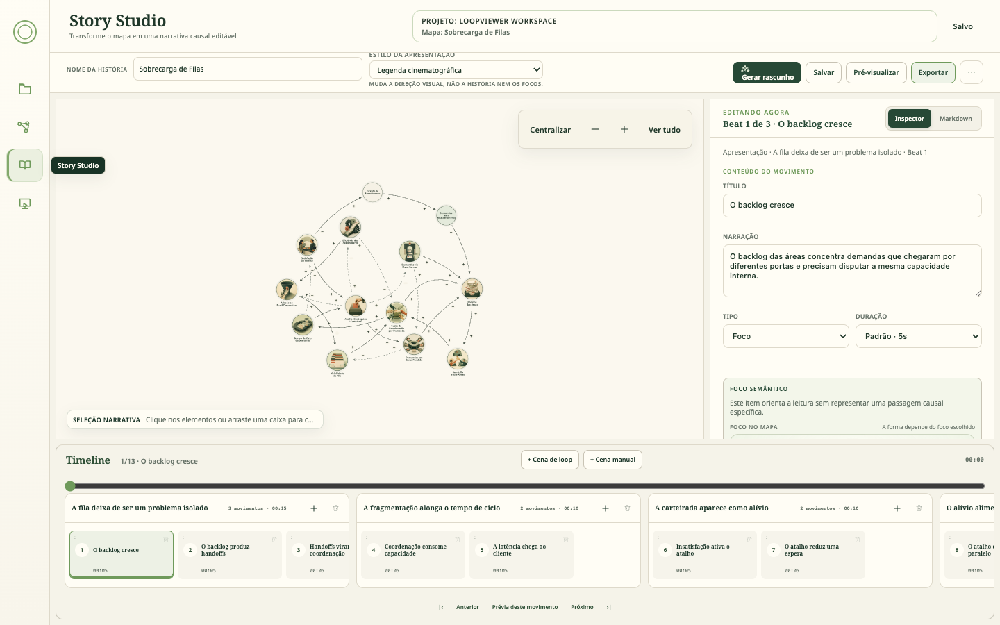

# Trama

**Mapeie sistemas, conte a história dos feedbacks e entregue uma apresentação navegável.**

Trama é uma aplicação local-first para criar, explorar e apresentar Diagramas de Loops
Causais (CLDs). Pessoas podem trabalhar pela interface visual; agentes podem operar os mesmos
artefatos em Markdown, validar o modelo e usar o motor público sem depender de um harness
específico.



O projeto está na série `0.x`, é distribuído sob a [licença MIT](LICENSE) e inclui apenas uma
demonstração anônima e ilustrada: **Sobrecarga de Filas**.

## O que você consegue fazer

- criar variáveis e relações causais com polaridades explícitas;
- organizar posições, rotas, estilos e diferentes vistas do mesmo mapa;
- descobrir ciclos e curar loops reforçadores ou balanceadores;
- descrever o sistema em Markdown sem misturar narrativa com o modelo;
- criar apresentações com cenas, beats, foco semântico e câmera explícita;
- reproduzir a história passo a passo no modo **Apresentar**;
- persistir projetos localmente em SQLite;
- exportar HTML autocontido, executável offline e sem CDN;
- integrar o motor reutilizável por `CLD.createCLD()`.

## Comece em cinco minutos

Requisitos: Node.js 22.5 ou superior, npm e um navegador moderno.

```bash
git clone <URL-DO-REPOSITORIO>
cd <PASTA-CLONADA>
npm ci
npm run check
npm run serve
```

Abra [http://127.0.0.1:4173](http://127.0.0.1:4173). Na primeira execução, o projeto local e o
banco `data/trama.db` são criados com o mapa **Sobrecarga de Filas** e sua Presentation V2.

O servidor fica restrito a `127.0.0.1` por padrão. Ele é uma aplicação local e não deve ser
exposto diretamente à internet.

## Um passeio pela aplicação

### 1. Projetos: cada trabalho permanece local

Abra ou crie bancos SQLite, importe Markdown e organize vários mapas sem enviar conteúdo para um
serviço externo. Arquivos em `data/*.db` são ignorados pelo Git.



### 2. Editor: estrutura e visual no mesmo lugar

O Editor reúne canvas, descrição, Inspector, Markdown, estilos, dados e histórico. O mapa continua
sendo o artefato causal; nenhuma Presentation é escondida dentro de `model.story`.



### 3. Story Studio: transforme estrutura em narrativa

Cenas organizam viradas narrativas. Beats explicam movimentos causais individuais. Cada foco
referencia nós, relações, caminhos ou loops que realmente existem no mapa.



### 4. Apresentar: conduza a leitura do sistema

A Presentation V2 controla enquadramento, destaque e progressão sem duplicar o mapa. O mesmo
contrato alimenta a prévia, o player e a exportação offline.


As imagens acima foram capturadas da branch pública, em uma instalação limpa, usando somente a
demonstração incluída no repositório.

## Feito para agentes — sem dependência de harness

Trama não exige Codex, Claude, Cursor, MCP ou um framework de agentes específico. Um agente
precisa apenas conseguir:

1. ler e editar arquivos do repositório;
2. executar comandos Node/npm;
3. respeitar IDs estáveis e os contratos documentados;
4. devolver mudanças verificáveis em Git.

O protocolo é baseado em artefatos, não na ferramenta que os produz:

```text
descrição do sistema
        ↓
seeds/<slug>.loop.md       mapa, relações, sinais e ciclos
        +
seeds/<slug>.story.md      cenas, beats, focos e trajetória
        ↓
compilação + validação + lint
        ↓
ProjectStore / SQLite
        ↓
Editor → Story Studio → Apresentar → HTML offline
```

### Contrato mínimo para um agente

- Leia [AGENTS.md](AGENTS.md) antes de alterar mapas ou apresentações.
- Use `.agents/skills/mermaid-to-trama/SKILL.md` quando a origem for um diagrama Mermaid.
- Dê IDs estáveis a nós e relações; não derive polaridades mecanicamente do rótulo.
- Mantenha mapa e Presentation em arquivos separados.
- Toda cena deve apontar para o mapa real com `mapRef`.
- Use apenas focos existentes: `node`, `edge`, `loop`, `path` ou `set`.
- Não crie `model.story` nem um formato narrativo paralelo.
- Execute `npm test` e `npm run check` antes do handoff.

Exemplo de pedido que funciona com qualquer agente de código:

> Leia `AGENTS.md` e converta meu diagrama causal para
> `seeds/meu-sistema.loop.md`. Crie também `seeds/meu-sistema.story.md`, valide sinais,
> ciclos, focos e câmera contra o mapa real, execute os gates do projeto e relate os arquivos
> alterados e os testes.

Esse processo permite usar um agente no terminal, numa IDE, em CI ou dentro de uma orquestração
maior sem acoplar o conteúdo a mensagens privadas, memória de conversa ou APIs proprietárias.

## A demonstração pública

`seeds/` contém somente:

- `sobrecarga-filas.loop.md`: fonte legível do mapa;
- `sobrecarga-filas.story.md`: fonte legível da narrativa;
- `sobrecarga-filas.public.json`: modelo e Presentation V2 usados na primeira execução.

As 11 ilustrações otimizadas da demo ficam em `assets/demo/sobrecarga-filas/`. Elas são semeadas
como assets locais, referenciadas por IDs estáveis nos nós e possuem texto alternativo. Os dois nós
de entrada contextual permanecem tipográficos para preservar a hierarquia visual do mapa.

A demonstração mostra como backlog, handoffs, custo de coordenação, latência e atalhos formam
feedbacks concorrentes. Ela é inteiramente anônima e não representa dados de uma organização real.

## Usando o motor no browser

O build gera `dist/cld-engine.iife.js`. Carregue Cytoscape e um layout antes do motor:

```html
<link rel="stylesheet" href="styles.css">
<div id="graph" style="width:100%;height:700px"></div>

<script src="https://unpkg.com/cytoscape@3.30.4/dist/cytoscape.min.js"></script>
<script src="https://unpkg.com/layout-base/layout-base.js"></script>
<script src="https://unpkg.com/cose-base/cose-base.js"></script>
<script src="https://unpkg.com/cytoscape-cose-bilkent@4.1.0/cytoscape-cose-bilkent.js"></script>
<script src="dist/cld-engine.iife.js"></script>
<script>
  cytoscape.use(cytoscapeCoseBilkent);

  const viewer = CLD.createCLD({
    container: "#graph",
    model: {
      id: "example",
      nodes: [
        { id: "demand", label: "Demanda" },
        { id: "backlog", label: "Backlog" }
      ],
      edges: [{
        id: "demand-backlog",
        source: "demand",
        target: "backlog",
        sourceSign: "+",
        targetSign: "+",
        description: "Mais demanda aumenta o backlog."
      }],
      loops: []
    }
  });
</script>
```

O contrato completo é exportado por [`src/index.js`](src/index.js). Além de `createCLD()`, ele
inclui validação de modelos, descoberta e classificação de loops, compilação e lint de
Presentations, controller de reprodução, exportação e medição de performance.

## Persistência e segurança local

- bancos ficam em `data/` e não são versionados;
- o servidor escuta apenas loopback por padrão;
- requisições mutáveis feitas pelo browser exigem mesma origem;
- payloads JSON possuem limite padrão de 5 MiB;
- caminhos de banco ficam restritos a `data/`;
- `TRAMA_ALLOW_EXTERNAL_DB=1` permite deliberadamente bancos externos;
- `TRAMA_MAX_JSON_BYTES` altera o limite de JSON;
- definir `HOST` amplia deliberadamente a interface de rede.

O servidor local não possui autenticação. Para uso público, use o modo hospedado abaixo em vez de
expor `server.mjs`.

## Modo hospedado: Trama online, sem conta

`npm run serve:hosted` (`server-hosted.mjs`) publica o mesmo app para qualquer pessoa, como em
`https://trama.org-agents.work`:

- cada pessoa cria um **espaço** isolado (um `.db` por espaço), acessado por um link secreto de
  edição `/w/<token>`;
- o link de leitura `/p/<token>` mostra mapas e apresentações sem permitir edição;
- agentes usam MCP (`/mcp` ou `/w/<token>/mcp`), a API REST (`/api/v1`, com OpenAPI) ou a CLI
  `cli/trama.mjs`, sem dependências;
- o guia de autoria para agentes é servido em `/llms.txt`;
- o servidor serve só uma lista fixa de arquivos e aplica limites de corpo, cotas por espaço, rate
  limit e retenção.

```bash
npm run build
TRAMA_PUBLIC_URL=http://localhost:4180 npm run serve:hosted
```

Arquitetura, segurança, limites e deploy na VPS: [docs/HOSTING.md](docs/HOSTING.md).

## Migração de LoopViewer para Trama

Trama é o novo nome do aplicativo, do pacote, dos exports e dos contratos criados a partir desta
versão. Instalações existentes continuam abrindo `data/loopviewer.db` quando ainda não existe um
`data/trama.db`, backups com o formato legado continuam importáveis e as antigas variáveis de
ambiente e pontes JavaScript seguem aceitas como aliases de transição. Novas integrações devem usar
os nomes `TRAMA_*`, `trama-project`, `.trama.json`, `window.TramaReact` e `window.tramaDemo`.

O inventário completo de compatibilidade está em
[`docs/BRAND_MIGRATION_TO_TRAMA.md`](docs/BRAND_MIGRATION_TO_TRAMA.md).

## Desenvolvimento e QA

### Landing do Trama

A landing editorial possui uma demonstração real do motor: apresentação guiada,
exploração e edição de uma cópia temporária, com desfazer e download em JSON.

```bash
npm run build:landing
npm run serve:landing     # http://127.0.0.1:4180/
npm run check:landing     # validação do exemplo, build e QA de navegador
```

O artefato estático fica em `dist/landing/`. Não depende do banco local nem de
serviços externos. As fontes autorais e os limites da demonstração estão em
[`landing/README.md`](landing/README.md). A hospedagem pública e o MCP são etapas
posteriores; esta implementação não os publica.

### Aplicação e motor

```bash
npm test                 # testes Node
npm run qa:story         # contrato do Story Studio
npm run build            # bundles em dist/
npm run check            # gate local: testes + Story Studio + build
npm run check:ui         # Playwright + regressão visual + acessibilidade
npm run serve            # aplicação local
```

A CI executa instalação limpa, testes, build e QA de navegador em pushes e pull requests.
`dist/` é gerado por `npm run build`; não edite bundles manualmente.

## Estrutura do repositório

```text
src/core/          modelo de domínio e loops
src/geometry/      matemática pura
src/routing/       cálculo e diagnóstico de rotas
src/annotations/   polaridades e zoom semântico
src/rendering/     adaptação para Cytoscape
src/presentation/  Presentation V2, câmera, lint e export
src/platform/      persistência SQLite local
src/app/           composição da aplicação
server/            rotas de projeto compartilhadas e modo hospedado (Trama online)
cli/trama.mjs      CLI para agentes (modo hospedado)
deploy/            Docker Compose, drop-in nginx, deploy e backup
seeds/             demonstração pública e suas fontes
docs/images/       capturas da aplicação pública
tests/             testes Node
e2e/               testes Playwright e baselines visuais
```

Leitura recomendada:

- [Arquitetura](docs/ARCHITECTURE.md)
- [Como estender](docs/EXTENDING.md)
- [Como contribuir](CONTRIBUTING.md)
- [Política de segurança](SECURITY.md)
- [Guia para agentes](AGENTS.md)
- [Hospedagem pública](docs/HOSTING.md)

## Limitações atuais

- a série `0.x` ainda pode evoluir contratos antes da versão `1.0`;
- self-loops e múltiplas arestas paralelas possuem suporte limitado;
- o roteamento é heurístico, não uma solução ótima global;
- a API ESM ainda não é distribuída como pacote npm;
- a aplicação é local-first e não inclui autenticação multiusuário.

## Licença

[MIT](LICENSE). As fontes Noto incluídas mantêm seus próprios arquivos de licença em
`assets/fonts/`.
