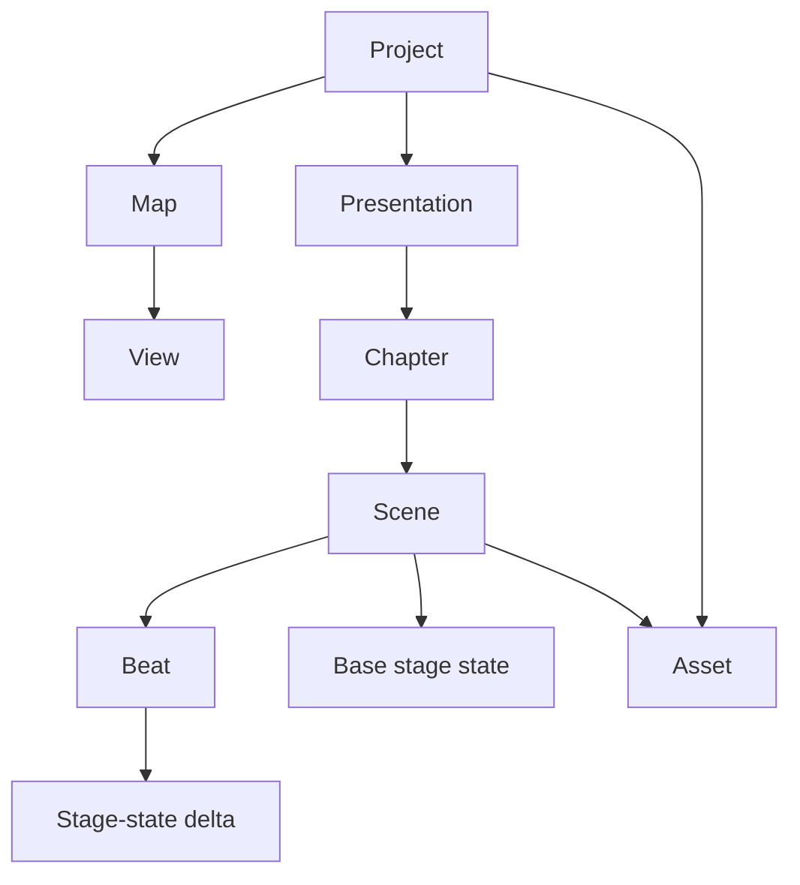
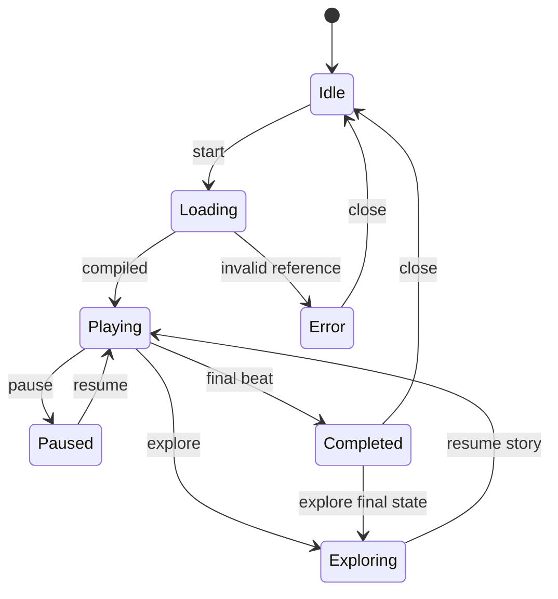
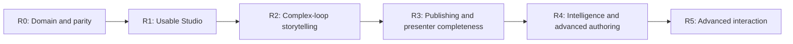

# Story Mode V2 — Product, UX and Implementation Specification

Status: `implemented foundation; active iteration`

Version: `1.0`

Last updated: `2026-07-14`

Primary objective: turn Trama into a local-first environment for authoring, playing and
exporting rigorous, beautiful narratives about complex causal-loop systems.

This document is the source of truth for Story Mode V2. It connects product intent, user stories,
features, implementation tasks, acceptance criteria, quality gates, migration and delivery phases.

Related documents:

- `docs/KUMU_BENCHMARK_AND_PRODUCT_SPEC.md`
- `docs/AGENT_IMPLEMENTATION_BRIEF.md`
- `docs/LOOP_LANGUAGE_SPEC.md`
- `docs/ARCHITECTURE.md`
- `docs/IMPLEMENTATION_STATUS.md`
- `docs/ROADMAP.md`

## 1. Executive Summary

Story Mode V2 is not a slide editor placed on top of a graph. It is a causal-narrative system for
explaining how mechanisms form, how loops close, how multiple loops interact, when one loop becomes
dominant, where delays and side effects appear, and how interventions change the system.

The main product shift is:

```text
Current runtime: Presentation -> Chapters -> Scenes -> Beats -> deterministic stage states
Historical input: model.story.steps -> one-time migration only
```

The author should be able to select complex loops, state the idea the audience must understand,
receive a coherent editable draft, direct the story visually on the map, validate its causal and
narrative quality, and export the same experience to a self-contained HTML file.

The target experience must combine:

- causal rigor;
- extremely low-friction creation;
- progressive disclosure of advanced controls;
- cinematic but restrained visual direction;
- exact parity between editor preview and standalone playback;
- local-first persistence and export;
- one-time import compatibility for existing `model.story` data, without retaining it in runtime records.

## 2. Current State and Product Gap

### 2.1 Capabilities already delivered

The current codebase already contains important foundations:

- typed story steps: `map`, `title`, `text` and `image`;
- focus on one node, edge or loop;
- camera, reveal, duration, transition and autoplay fields;
- a `PresentationController` independent from the UI;
- project-level `presentations` and local `assets` tables;
- standalone HTML export with story playback;
- `.loop.md` parsing and serialization for story steps;
- local SQLite persistence and offline-capable publishing.

These foundations must be evolved, not discarded.

### 2.2 Structural gaps

The existing implementation has the following limitations:

1. Project-level `Presentation` is the only visible authoring and playback unit. Historical
   `model.story` data is converted once and removed from persisted models.
2. The editor is primarily a vertical list of fields, not a visual storyboard.
3. A step can reference exactly one node, edge or loop; complex causal compositions need paths,
   multiple loops, regions and comparisons.
4. During playback, loop and node steps are expanded into edge steps. This can discard authored
   scene properties and changes the author's intended scene structure.
5. Editor and standalone runtimes implement overlapping presentation logic separately, creating
   drift risk.
6. Automatic drafts enumerate relations but do not construct an argument, phase structure or
   multi-loop handoff.
7. Camera, reveal and timing are technically available but not easy to author or understand.
8. There is no story-quality validation beyond structural references.
9. The system does not model loop roles, dominance, intervention or counterfactual framing.
10. Presentation versions, recovery and review are not first-class.

### 2.3 Product diagnosis

The current implementation is a capable V1 playback mechanism. Story Mode V2 must become an
authoring and reasoning surface. The most important work is not adding more slide types. It is
establishing a coherent narrative domain, a direct-manipulation studio and one shared deterministic
player.

## 3. Product Vision

Trama should be the best environment for explaining complex causal systems as guided stories.

The north-star workflow is:

1. Select one or more loops.
2. Choose `Contar uma história`.
3. State audience, intent and desired conclusion.
4. Receive an editable causal narrative organized into chapters, scenes and beats.
5. Direct the story by manipulating the real map and capturing states.
6. Validate causal continuity, pacing, readability and accessibility.
7. Rehearse in presenter mode.
8. Export a self-contained experience that behaves exactly like the editor preview.

### 3.1 Product promise

> Turn a complex causal map into a clear, rigorous and memorable story without requiring the author
> to become a presentation designer or manipulate technical IDs.

### 3.2 Differentiation

Trama must not become a generic PowerPoint clone. Its advantage is that it understands:

- ordered causal relations;
- endpoint polarities;
- reinforcing and balancing loops;
- shared variables and relations;
- causal paths and handoffs;
- delays;
- competing mechanisms;
- authored interventions and unintended consequences.

Every presentation capability should take advantage of this causal structure.

## 4. Product Principles

### PR-01 — Causal meaning before visual spectacle

Animation, emphasis and camera movement must clarify causal reasoning. They must never imply a
direction, magnitude, timing or certainty not present in the model or authored narrative.

### PR-02 — Simple by default, complete on demand

Common actions use direct controls and sensible defaults. Technical camera values, selectors,
state deltas and textual representations remain available in an Advanced mode.

### PR-03 — The canvas is the authoring surface

Authors should create scenes and beats from their current selection and visible map state instead
of entering element IDs in forms.

### PR-04 — One authored scene remains one scene

A loop may contain several beats, but playback must not silently convert the scene into unrelated
slides or discard its camera, reveal, content, timing or transition.

### PR-05 — Model, view and presentation remain separate

The causal map is semantic truth. Views style and filter it. Presentations reference maps and views
and add temporary stage states without mutating the underlying model.

### PR-06 — Deterministic, portable playback

The same compiled presentation state must produce equivalent output in editor preview, standalone
HTML and embed mode.

### PR-07 — Local-first remains non-negotiable

Core authoring, playback, validation and export must work without a hosted service or remote CDN.

### PR-08 — Generated assistance remains reviewable

Suggestions must explain their rationale. No assistant may silently rewrite causal signs, loops or
model descriptions.

### PR-09 — Editorial content stays editorial

Presentation notes, conversion rationale and process metadata must not be written into a loop's
`description_md` or relation descriptions.

### PR-10 — Accessibility is part of authorship

Keyboard use, reduced motion, contrast, alt text and logical reading order must be supported during
creation and playback, not added only at export time.

## 5. Goals and Non-goals

### 5.1 Goals

| ID | Goal |
| --- | --- |
| G-01 | Create a coherent first draft from selected loops in at most three primary decisions. |
| G-02 | Explain a single loop relation by relation without fragmenting the authored scene. |
| G-03 | Explain interactions and handoffs among multiple loops. |
| G-04 | Author camera, visibility, reveal and emphasis through direct manipulation. |
| G-05 | Support chapters, scenes and beats with clear navigation and reordering. |
| G-06 | Provide causal, narrative, visual and accessibility linting. |
| G-07 | Support guided, presenter, autoplay and explore modes. |
| G-08 | Preserve exact editor/standalone behavioral parity. |
| G-09 | Autosave and version presentations in the local SQLite project. |
| G-10 | Migrate existing `model.story` data without destructive changes. |
| G-11 | Allow advanced text-first authoring and stable round-trip serialization. |
| G-12 | Keep core playback usable without AI or network access. |

### 5.2 Non-goals

- Real-time multiplayer authoring.
- A general-purpose presentation or video-editing application.
- Quantitative system-dynamics simulation in V2.
- Automatically inferring empirical magnitude or time from a qualitative loop.
- Hosted publishing as a requirement for sharing.
- Arbitrary third-party JavaScript execution inside presentation content.
- Silent model mutations performed by narrative assistance.
- Pixel-perfect mobile authoring in the first release; mobile playback is required.

## 6. Success Metrics and Product Budgets

### 6.1 Usability targets

| Metric | Target |
| --- | --- |
| Create a presentation from selected loops | At most 3 primary decisions after selection |
| Capture current map as a scene | At most 2 actions |
| Add a beat from current selection | 1 explicit action |
| Reorder a scene | Direct drag-and-drop |
| Preview from selected beat | 1 action or keyboard shortcut |
| Recover from an invalid edit | No data loss; actionable inline error |
| Export standalone | One explicit export action after validation |

### 6.2 Runtime budgets

Budgets apply to a reference project with up to 100 nodes, 150 relations, 12 curated loops, 30
scenes and 100 beats, excluding unusually large media files.

| Operation | Budget |
| --- | --- |
| Storyboard selection/reorder feedback | under 100 ms |
| Advance to next beat before animation begins | p95 under 150 ms |
| Thumbnail update after idle | under 500 ms |
| Presentation validation | under 300 ms |
| Autosave after debounce | under 1 s, non-blocking |
| Compile standalone without heavy media | under 2 s |
| Restore authored scene state | deterministic, no visible intermediate state |

### 6.3 Quality targets

- Zero unresolved error-level Story Lint findings before export.
- Full keyboard navigation for editor storyboard and player.
- WCAG 2.2 AA for authoring controls and playback UI.
- Reduced-motion playback with no essential information conveyed only by animation.
- Application preview and standalone produce matching compiled state snapshots for every beat.
- No network request from a self-contained standalone file.

## 7. Personas and Jobs To Be Done

### P-01 — Systems thinker or consultant

Needs to explain a complex mechanism to clients, build a persuasive narrative, compare loops and
export a polished artifact quickly.

### P-02 — Researcher or analyst

Needs causal rigor, traceable references, evidence-aware annotations, stable text serialization and
reviewable changes.

### P-03 — Product strategist or operator

Needs to communicate problem dynamics, competing mechanisms and intervention trade-offs to a
decision-making audience.

### P-04 — Educator or facilitator

Needs progressive reveal, questions, branching exploration and a presenter view that supports live
explanation.

### Primary JTBD

> When I need to teach, persuade or facilitate around a complex causal system, I want to construct a
> guided narrative from real loops and their interactions so that the audience understands both the
> mechanism and the consequences of acting within it.

### Supporting JTBDs

- Turn an existing loop into a first draft without manually creating every step.
- Preserve causal correctness while simplifying the visual explanation.
- Adapt the same system to executive, technical and teaching audiences.
- Compare mechanisms, phases and interventions without duplicating the base map.
- Rehearse and share the result without depending on a server.

## 8. Ubiquitous Language and Information Architecture

### 8.1 Canonical hierarchy



### 8.2 Definitions

| Term | Definition |
| --- | --- |
| Presentation | A project-level authored narrative that may reference multiple maps and views. |
| Chapter | A named phase of the argument containing ordered scenes. |
| Scene | A stable narrative and visual context with content, base stage state and zero or more beats. |
| Beat | An incremental causal or visual change within a scene. |
| Stage state | Camera, visibility, emphasis, annotations and style state applied without mutating the map. |
| Focus | The semantic subject of a scene or beat: element, loop, path, set, region or query result. |
| Handoff | The authored or detected bridge through which the story moves from one loop to another. |
| Loop role | Editorial role played by a loop in this presentation, such as motor, limit or side effect. |
| Phase | A qualitative period in which a mechanism or loop is framed as becoming more or less relevant. |
| Scenario | An authored comparative state; it does not imply quantitative simulation. |
| Compiled timeline | Fully resolved deterministic sequence used by the player and standalone export. |
| Story Lint | Structural, causal, narrative, visual and accessibility validation of a presentation. |

### 8.3 Why scenes and beats are distinct

A scene owns the audience's current context. Beats reveal or modify details within that context.
This prevents a loop with eight relations from becoming eight unrelated slides and allows one title,
camera composition and narrative purpose to remain stable while the mechanism unfolds.

## 9. Presentation V2 Domain Model

### 9.1 Canonical JSON shape

```json
{
  "schemaVersion": 2,
  "id": "limits-to-growth-story",
  "title": "When Growth Creates Its Own Limit",
  "summary": "How R1 activates B1 and produces an intervention dilemma.",
  "intent": "explain-and-persuade",
  "audience": {
    "type": "executive",
    "knowledge": "introductory",
    "expectedOutcome": "Recognize capacity as a leverage point"
  },
  "themeId": "matcha-editorial",
  "settings": {
    "autoplay": false,
    "defaultBeatDurationMs": 5000,
    "allowExplore": true,
    "resumeAfterExplore": true,
    "showChapterProgress": true
  },
  "chapters": [
    {
      "id": "chapter-pressure",
      "title": "The growth engine",
      "role": "setup",
      "scenes": [
        {
          "id": "scene-r1",
          "type": "stage",
          "mapRef": { "mapId": "growth-map", "viewId": "executive-view" },
          "content": {
            "title": "Demand reinforces capacity",
            "bodyMd": "The first mechanism is reinforcing.",
            "speakerNotesMd": "Pause before closing the loop."
          },
          "causalFrame": {
            "loopRoles": [{ "loopId": "R1", "role": "motor" }],
            "primaryLoopId": "R1"
          },
          "stage": {
            "camera": { "mode": "fit-focus", "padding": 180 },
            "visibility": {
              "context": ["node-market"],
              "ghost": ["loop:B1"],
              "hidden": []
            },
            "emphasis": [{ "kind": "loop", "id": "R1", "level": "primary" }],
            "annotations": []
          },
          "transition": { "type": "dissolve", "durationMs": 320 },
          "beats": [
            {
              "id": "beat-r1-build",
              "type": "traverse",
              "title": "Close the reinforcing loop",
              "narrationMd": "Demand expands planning, capacity and availability.",
              "focus": {
                "kind": "path",
                "edgeIds": ["demand-plan", "plan-capacity", "capacity-demand"]
              },
              "delta": {
                "reveal": { "edgeIds": ["demand-plan", "plan-capacity", "capacity-demand"] },
                "flow": { "mode": "ordered", "direction": "causal" }
              },
              "timing": { "durationMs": 7000, "advance": "manual" }
            }
          ]
        }
      ]
    }
  ]
}
```

### 9.2 Entity requirements

#### Presentation

Required:

- `schemaVersion`;
- stable `id`;
- `title`;
- ordered `chapters`.

Optional:

- summary, intent, audience, expected outcome;
- theme and default playback settings;
- tags and custom fields;
- cover asset;
- source/migration metadata kept outside audience-facing content.

#### Chapter

Required:

- stable `id`;
- title;
- ordered scenes.

Supported chapter roles:

- `setup`;
- `mechanism`;
- `tension`;
- `intervention`;
- `consequence`;
- `synthesis`;
- `custom`.

The role supplies defaults and lint guidance. It does not force a narrative formula.

#### Scene

V2 scene types:

- `title`: opening, section break or conclusion;
- `stage`: map-centered causal explanation;
- `narrative`: text-centered explanation with optional map context;
- `media`: image-centered scene with caption and alt text;
- `comparison`: side-by-side or before/after visual states;
- `choice`: audience branch point; post-MVP.

Every scene may define:

- map and view references;
- content and presenter notes;
- base stage state;
- causal frame;
- beats;
- scene transition;
- timing;
- audience actions;
- layout and theme overrides.

#### Beat

V2 beat types:

- `focus`: move attention without revealing new structure;
- `reveal`: add elements or annotations;
- `traverse`: follow an ordered causal path;
- `handoff`: move from one loop to another;
- `compare`: change or split comparison state;
- `intervention`: introduce an authored change or leverage point;
- `consequence`: reveal direct or second-order consequences;
- `question`: pause and frame an audience question;
- `custom`.

Each beat is a semantic delta over the scene state. It must not mutate the source map or view.

### 9.3 Focus model

```ts
type StoryFocus =
  | { kind: "node"; nodeId: string }
  | { kind: "edge"; edgeId: string }
  | { kind: "loop"; loopId: string }
  | { kind: "path"; edgeIds: string[] }
  | { kind: "set"; nodeIds?: string[]; edgeIds?: string[]; loopIds?: string[] }
  | { kind: "region"; regionId: string }
  | { kind: "query"; selector: string };
```

Rules:

- A focus must resolve to at least one existing element at compile time.
- An ordered path must be directionally continuous.
- A loop focus uses its curated ordered `edgeIds`; discovered loops require explicit promotion or a
  frozen reference in the presentation.
- Query focus is an advanced feature and must compile to explicit IDs for standalone output.
- Missing references are errors, not silent omissions.

### 9.4 Stage-state semantics

A scene stores a complete base stage state. Each beat stores a delta. The compiler resolves every
beat into a complete immutable playback state.

Stage-state dimensions:

- `camera`;
- `visibility`;
- `emphasis`;
- `annotations`;
- `flow`;
- `contentLayout`;
- `themeOverride`;
- `interactionPolicy`.

Visibility levels are ordered and distinct:

1. `hidden`: not rendered and not interactive;
2. `ghost`: visible as low-opacity structural context;
3. `context`: normally visible but subordinate;
4. `focused`: current narrative subject;
5. `emphasized`: persistent primary subject.

### 9.5 Camera model

Supported modes:

- `fit-map`;
- `fit-focus`;
- `fit-set`;
- `fixed`, with authored zoom and pan;
- `follow-path` for causal traversal;
- `split` for comparisons.

The authoring UI should expose intent-based controls first. Raw zoom and pan values live in Advanced
mode. Camera transitions must have reduced-motion fallbacks. `fit-focus` is
the required persisted intent for a focused beat; the runtime does not infer a
focused camera from an old step format.

### 9.6 Transition model

Scene transitions:

- `cut`;
- `dissolve`;
- `slide`;
- `morph-stage` when both scenes reference compatible map/view states.

Beat transitions:

- `instant`;
- `fade`;
- `draw`;
- `pulse`;
- `flow`;
- `camera`.

Transitions describe presentation behavior only. They do not modify the causal model.

## 10. Narrative Grammar for Complex Loops

### 10.1 Default causal arc

The recommended default arc is:

1. Orient the audience to the system and question.
2. Introduce the initial condition or trigger.
3. Build the first mechanism.
4. Close and classify the primary loop.
5. Introduce a limit, delay or competing mechanism.
6. Show the handoff between loops.
7. Explain tension or dominance across phases.
8. Introduce an intervention or leverage point.
9. Reveal direct and second-order consequences.
10. Return to a synthesis view and desired conclusion.

The system may suggest this arc but must allow authors to replace it.

### 10.2 Loop roles

Presentation-specific loop roles:

- `motor`;
- `accelerator`;
- `limit`;
- `stabilizer`;
- `compensation`;
- `constraint`;
- `side-effect`;
- `trap`;
- `institutional-response`;
- `leverage-response`;
- `custom`.

A role is editorial metadata. It must not overwrite the loop's reinforcing/balancing classification.

### 10.3 Handoffs

A handoff connects two loops through:

- a shared node;
- a shared edge;
- a directed path;
- an explicit authored bridge.

The authoring assistant may suggest handoffs based on topology. The author chooses the bridge and
the narrative meaning. The player should preserve context from the outgoing loop while introducing
the incoming loop.

### 10.4 Phases and dominance

V2 supports qualitative phases such as:

- emergence;
- acceleration;
- constraint activation;
- response;
- adaptation;
- stabilization;
- collapse;
- recovery.

Authors may state that a loop is framed as dominant within a phase. The UI must label this as an
authored interpretation unless backed by a future simulation source. V2 must never calculate or
imply quantitative dominance from topology alone.

### 10.5 Interventions and counterfactuals

An intervention is a presentation-layer object that references one or more model elements and
describes an authored change. It can be used to compare stage states without rewriting the map.

Required fields:

- target references;
- intervention statement;
- intended effect;
- direct consequence;
- optional second-order consequence;
- confidence or evidence note where relevant.

Counterfactual scenes are qualitative comparisons unless a future simulation adapter provides
explicit computed state.

### 10.6 Narrative templates

V2 must ship with deterministic templates:

| Template | Intended result |
| --- | --- |
| Explain one loop | Build, close, classify and summarize one loop. |
| Multiple-loop interaction | Introduce loops separately, show handoff, tension and synthesis. |
| Limits to growth | Present reinforcing growth, delayed constraint and balancing response. |
| Problem to leverage point | Move from symptom to mechanism, intervention and consequences. |
| Before and after intervention | Compare baseline and authored intervention states. |
| Executive overview | Compress complexity into conclusion-led chapters. |
| Teaching walkthrough | Progressive reveal with questions and recap scenes. |

Templates generate editable structure, not locked content.

## 11. Authoring Experience Specification

### 11.1 Entry points

Authors can create a presentation from:

- the project-level `Presentations` workspace;
- a selected curated loop;
- multiple selected loops;
- a selected causal path;
- the current map/view state;
- an existing presentation via duplicate;
- an external legacy `model.story` via the one-time migration utility only; persisted runtime records are V2 `Presentation` entities.

The primary action label is `Contar uma história`.

### 11.2 Creation flow

The default creation flow asks for only three decisions:

1. **What should the audience understand?** Free text with useful examples.
2. **Who is the audience?** Executive, technical, teaching or custom.
3. **How should the story be structured?** Recommended template first, alternatives visible.

Selected loops and current map context are already carried into the flow. All other settings use
defaults and remain editable later.

The result is a generated but fully editable storyboard with a visible explanation of why loops and
handoffs were ordered that way.

### 11.3 Studio layout

Desktop authoring uses four coordinated regions:

```text
+--------------------------------------------------------------------------------+
| Presentation toolbar: title, save state, preview, validate, export             |
+----------------------+--------------------------------------+------------------+
| Storyboard           | Stage / live map                     | Inspector        |
| chapters/scenes      | selected scene or beat               | Basic/Advanced   |
| thumbnails/beats     | direct manipulation                  | properties       |
+----------------------+--------------------------------------+------------------+
| Optional notes/rehearsal strip: speaker notes, timing, next beat               |
+--------------------------------------------------------------------------------+
```

Recommended widths:

- Storyboard: resizable, default 280 px.
- Inspector: resizable, default 320 px.
- Stage: receives remaining space and never falls below a usable minimum.

### 11.4 Basic and Advanced modes

Basic mode exposes:

- title and narrative;
- scene/beat type;
- focus picker;
- reveal and keep-as-context controls;
- camera intent;
- timing preset;
- transition preset;
- notes;
- accessibility requirements.

Advanced mode adds:

- raw stage-state values;
- selectors and queries;
- exact zoom/pan;
- timing values and easing;
- style overrides;
- compiled-state inspection;
- textual source and validation details.

Switching modes must not alter data.

### 11.5 Storyboard behavior

The storyboard supports:

- expand/collapse chapters;
- scene thumbnails rendered from compiled states;
- beat list nested within selected scene;
- drag-and-drop reordering;
- keyboard reordering;
- duplicate, delete and multi-select;
- grouping selected scenes into a chapter;
- copying scene direction while keeping different content;
- badges for type, duration, loop references and lint status;
- current playback marker;
- search by title, loop, variable or tag.

Deletion must offer Undo and must not immediately destroy referenced assets.

### 11.6 Directing from the canvas

The author manipulates the real map, then uses:

- `Capturar como cena`;
- `Atualizar estado da cena`;
- `Adicionar beat com a seleção`;
- `Percorrer este loop`;
- `Manter como contexto`;
- `Ocultar`;
- `Destacar`;
- `Comparar`;
- `Anotar`.

No primary flow requires entering an element ID.

### 11.7 Focus picker

The focus picker provides:

- click on map;
- current selection;
- searchable lists of variables, relations and curated loops;
- path builder with start/end and candidate path preview;
- multi-selection;
- named regions;
- advanced selector input.

Invalid or ambiguous paths must be explained before they are saved.

### 11.8 Empty, loading and error states

Required states:

- no presentations in project;
- presentation with no chapters;
- chapter with no scenes;
- map reference unavailable;
- view reference unavailable;
- asset missing;
- invalid path after model edit;
- unsaved local changes;
- server unavailable after local edits;
- standalone compilation blocked by validation errors.

Every error state must preserve author data and offer a recovery action.

## 12. Player and Audience Experience

### 12.1 Shared state machine



### 12.2 Guided mode

- Next/previous traverse beats, then scenes, then chapters.
- Scene and chapter transitions are announced to assistive technology.
- Progress can show presentation, chapter and scene scope.
- The story card avoids covering the focused region.
- The full state is restored before each transition; playback never accumulates stale classes.

### 12.3 Presenter mode

Presenter mode includes:

- current scene and beat;
- next beat preview;
- speaker notes;
- elapsed and planned time;
- chapter progress;
- lint reminders marked as rehearsal-only;
- controls for jump, pause, explore and resume;
- optional second-window audience output in a later phase.

### 12.4 Autoplay

- Per-presentation default and per-beat override.
- Manual beats pause autoplay.
- Media loading must not race playback.
- Reduced-motion mode replaces camera and drawing animations with immediate state changes or fades.
- Autoplay never hides navigation or close controls.

### 12.5 Explore and resume

When exploration is allowed:

1. The current compiled story state is saved.
2. Audience or presenter can pan, zoom and inspect elements.
3. `Retomar história` restores the saved state deterministically.
4. The author can choose whether exploration resumes at the current beat or advances.

### 12.6 Branching

Branching is P3 and must not block linear V2.

A choice scene may offer authored destinations. Export validation rejects dead branches, missing
destinations and loops without an explicit exit policy.

### 12.7 Deep links

Supported URL state for standalone and embed:

- presentation ID;
- chapter ID;
- scene ID;
- beat ID;
- mode: guided, autoplay or explore;
- optional resume state stored locally, never required.

## 13. Story Director and Story Lint

### 13.1 Deterministic Story Director

The first Story Director must work without AI. It uses:

- curated loop order;
- loop classification;
- shared nodes and edges;
- causal paths;
- loop descriptions;
- relation descriptions;
- explicit delays and tags;
- user-selected intent, audience and conclusion.

It produces:

- recommended template;
- chapter outline;
- suggested scene and beat order;
- loop-role suggestions;
- handoff candidates;
- unresolved-content placeholders;
- rationale for every structural recommendation.

### 13.2 Optional AI assistance

An AI adapter may later propose copy, alternative arcs and summaries. Requirements:

- provider-agnostic interface;
- explicit user action;
- structured output validated against the same schema;
- visible diff before application;
- causal signs and loop membership remain read-only unless the user enters a separate model-edit flow;
- no AI dependency in playback, validation or export.

### 13.3 Story Lint categories

#### Structural errors

- duplicate IDs;
- missing map/view/asset references;
- invalid chapter/scene order;
- empty required fields;
- invalid branch target;
- invalid transition or timing value.

#### Causal errors

- broken ordered path;
- loop traversal that does not follow curated edge order;
- missing referenced loop;
- narration that declares the wrong reinforcing/balancing class when explicitly structured;
- intervention with no target;
- generated sign claim inconsistent with the model.

#### Narrative warnings

- variable used before it is introduced;
- unexplained jump between loops;
- repeated relation without new purpose;
- no synthesis after a complex comparison;
- intervention introduced without consequences;
- conclusion unrelated to stated desired outcome;
- chapter with no narrative role.

#### Visual warnings

- too many primary elements in one beat;
- camera jump above configurable threshold;
- focused elements outside viewport;
- content card overlaps focus in all candidate positions;
- insufficient contrast;
- excessive text density;
- thumbnail cannot represent the actual state.

#### Accessibility warnings

- image without alt text;
- essential meaning conveyed only by color or animation;
- autoplay beat too short for content;
- missing reduced-motion equivalent;
- interactive choice without keyboard label.

### 13.4 Severity

| Severity | Meaning | Export behavior |
| --- | --- | --- |
| Error | Story cannot resolve or would misrepresent model structure. | Blocks export. |
| Warning | Story can play but has a likely narrative, visual or accessibility problem. | Requires review acknowledgment. |
| Suggestion | Optional improvement. | Does not block. |

### 13.5 Fix workflow

- Findings link to the exact chapter, scene, beat and field.
- Safe deterministic fixes can offer `Corrigir` with preview.
- Ambiguous fixes explain options instead of selecting silently.
- Dismissed warnings store rationale at presentation metadata level, not in audience-facing copy.

## 14. Visual, Content and Media Specification

### 14.1 Matcha continuity

Story Mode V2 extends the existing Matcha language:

- warm neutral stage;
- restrained greens and earth tones;
- editorial typography;
- subtle depth;
- high information clarity;
- no generic startup gradients or ornamental motion.

### 14.2 Content layouts

Initial layouts:

- corner card over stage;
- side editorial panel;
- centered title;
- split text/map;
- split comparison;
- full-bleed image with caption;
- question pause;
- minimal stage with presenter narration only.

The auto-placement system must avoid focused geometry and preserve readable measure.

### 14.3 Annotations

Presentation annotations are separate from map data:

- anchored callout;
- temporary label;
- highlighted region;
- bracket/group;
- question marker;
- evidence/source marker;
- intervention marker.

Annotations require stable semantic anchors where possible and stage coordinates only as fallback.

### 14.4 Assets

- Images remain local project assets.
- Standalone export embeds referenced assets as data URLs or equivalent self-contained data.
- Unreferenced assets are not exported.
- Large assets trigger size warnings and optional local compression.
- Alt text is required for audience-visible images.
- Remote URLs may be imported, but standalone compilation must localize or reject unresolved remote
  dependencies.

## 15. Accessibility and Keyboard Specification

### 15.1 Required keyboard operations

| Context | Operation |
| --- | --- |
| Storyboard | Navigate scenes/beats, expand chapters, reorder, duplicate, delete, rename |
| Stage | Move focus among selectable elements, add selection to beat, fit focus |
| Player | Next, previous, pause, resume, explore, return, close |
| Presenter | Jump to scene, toggle notes, start/stop timer |

Suggested shortcuts:

- `Space`: play/pause preview;
- `ArrowRight` / `ArrowLeft`: next/previous beat;
- `Shift+ArrowRight` / `Shift+ArrowLeft`: next/previous scene;
- `Cmd/Ctrl+Enter`: preview from selection;
- `Cmd/Ctrl+D`: duplicate selected scene or beat;
- `Cmd/Ctrl+S`: force save;
- `Escape`: leave preview or exploration before closing the studio.

Shortcuts must be discoverable and must not conflict with text editing.

### 15.2 Playback accessibility

- Logical DOM reading order follows title, narrative, focused context and controls.
- Dynamic focus changes are announced without excessive verbosity.
- Every visual focus state has a non-color cue.
- Reduced-motion preference is detected and can be overridden per presentation.
- Presenter-only notes never appear in audience output.
- Captions and transcripts are required if audio is introduced later.

## 16. Persistence, API and Versioning

### 16.1 Canonical persistence

`presentations.presentation_json` remains the canonical payload container and gains
`schemaVersion: 2`. Existing SQL storage can accept the V2 shape without destructive migration.

Add presentation version history comparable to loop history:

```sql
presentation_versions(
  id,
  presentation_id,
  presentation_json,
  reason,
  created_at
)
```

### 16.2 API requirements

| Method | Endpoint | Purpose |
| --- | --- | --- |
| GET | `/api/presentations` | List presentation summaries. |
| POST | `/api/presentations` | Create blank, templated or promoted presentation. |
| GET | `/api/presentations/:id` | Fetch full presentation. |
| PUT | `/api/presentations/:id` | Replace validated presentation with revision check. |
| PATCH | `/api/presentations/:id` | Apply scoped updates where useful. |
| DELETE | `/api/presentations/:id` | Delete with recoverable version policy. |
| POST | `/api/presentations/:id/duplicate` | Duplicate presentation with stable-reference rewrite. |
| GET | `/api/presentations/:id/versions` | List versions. |
| POST | `/api/presentations/:id/restore` | Restore selected version after snapshotting current state. |

Every update returns a monotonically increasing revision. Stale writes receive a conflict response
with enough data to reload or reconcile, even though the primary product is single-author.

### 16.3 Autosave

- Debounced after meaningful edits.
- Immediate save on structural operations when safe.
- Clear states: `Salvo`, `Salvando`, `Alterações locais`, `Conflito`, `Servidor indisponível`.
- Server outage preserves an in-memory/local recovery draft.
- Reconnect compares revisions before overwriting canonical data.

### 16.4 Version policy

Create automatic versions:

- before destructive structure changes;
- before restoring an older version;
- before legacy promotion;
- before applying a generated full-story replacement;
- periodically during long authoring sessions, with retention limits.

## 17. Standalone Export and Embed

### 17.1 Payload V3

Payload V3 contains:

- project metadata;
- only referenced maps and views;
- one or more V2 presentations;
- compiled deterministic timelines;
- referenced assets;
- active presentation/scene/beat;
- format and integrity metadata;
- optional exploration configuration.

### 17.2 Compilation

Before export:

1. Validate source presentation.
2. Resolve queries and discovered-loop references to explicit stable IDs.
3. Resolve inherited views.
4. Compile scene bases and beat deltas into full stage states.
5. Gather referenced assets.
6. Run parity fixtures against the shared player state model.
7. Serialize and escape the self-contained payload.

### 17.3 Parity contract

The editor and standalone must share:

- schema normalization;
- reference resolution;
- timeline compilation;
- state reducer;
- navigation rules;
- transition intent;
- reduced-motion behavior;
- Story Lint structural validation.

Only shell rendering and persistence adapters may differ.

### 17.4 Embed API

The iframe player should support a small postMessage API:

- `start`, `pause`, `next`, `previous`, `goTo`, `explore`, `resume`;
- events: `ready`, `statechange`, `complete`, `error`;
- presentation and beat identifiers in event payloads;
- origin validation and no arbitrary code execution.

## 18. Proposed Code Architecture

```text
src/presentation/
├── schema.js              # normalize and validate V2 source
├── references.js          # resolve maps, views, loops, paths and assets
├── compiler.js            # source -> deterministic compiled timeline
├── reducer.js             # pure playback state reducer
├── controller.js          # timing and navigation orchestration
├── migration.js           # historical model.story -> Presentation V2 import
├── templates.js           # deterministic narrative templates
├── director.js            # topology-based outline suggestions
├── lint/
│   ├── structural.js
│   ├── causal.js
│   ├── narrative.js
│   ├── visual.js
│   └── accessibility.js
└── index.js

src/app/storyStudio/
├── workspace.js
├── storyboard.js
├── inspector.js
├── stageCapture.js
├── focusPicker.js
├── lintPanel.js
└── presenter.js

src/standalone/presentation/
└── shell.js               # standalone-specific UI around shared player
```

### 18.1 Architectural boundaries

- `src/presentation/*` must remain DOM-independent where possible.
- Geometry and routing remain outside presentation code.
- The presentation layer requests focus and stage styles; it does not rewrite the map.
- The compiler and reducer must be pure and fully unit-tested.
- Demo and standalone shells consume the same compiled timeline.
- Historical `model.story` input is isolated in `src/presentation/migration.js`; it is not part of
  the runtime API or persisted model shape.

### 18.2 Event contract

Recommended shared events:

- `presentationload`;
- `presentationstart`;
- `chapterchange`;
- `scenechange`;
- `beatchange`;
- `presentationpause`;
- `explorestart`;
- `exploreend`;
- `presentationcomplete`;
- `presentationerror`.

Event details contain stable IDs, indexes, total counts and the resolved stage-state version.

## 19. Priority Definitions

| Priority | Meaning |
| --- | --- |
| P0 | Architectural or correctness prerequisite; blocks Story Mode V2. |
| P1 | Required for the first usable V2 release. |
| P2 | Required for the complete complex-loop storytelling vision. |
| P3 | Advanced expansion after the core system proves usable. |

## 20. User Story Catalog

Each story has a stable ID used in the feature catalog, task traceability matrix and acceptance
tests.

| ID | Priority | User story | Acceptance summary |
| --- | --- | --- | --- |
| ST-001 | P1 | As an author, I can create, open, duplicate, rename and delete project-level presentations. | Operations persist locally, preserve stable IDs and provide Undo/recovery for destructive actions. |
| ST-002 | P1 | As an author, I can start a presentation from selected loops, a path or the current view. | Current selection is carried into creation without requiring IDs or reselection. |
| ST-003 | P1 | As an author, I can state audience, intent and desired outcome. | These fields influence defaults and remain editable without regenerating the story. |
| ST-004 | P1 | As an author, I can begin from a deterministic narrative template and editable first draft. | Template produces valid chapters/scenes/beats and explains unresolved placeholders. |
| ST-005 | P1 | As an author, I can start blank or duplicate an existing presentation. | Duplicate rewrites presentation-local IDs and preserves semantic references. |
| ST-006 | P1 | As an author, I can organize the argument into named, ordered chapters. | Chapters support create, rename, reorder, collapse, duplicate and delete with Undo. |
| ST-007 | P1 | As an author, I can create different scene types and edit their content. | Title, stage, narrative, media and comparison scenes preview correctly. |
| ST-008 | P1 | As an author, I can add multiple beats inside one scene. | Beats change focus or stage state without fragmenting scene content or camera. |
| ST-009 | P1 | As an author, I can reorder, duplicate and group scenes and beats visually. | Drag, keyboard and multi-select operations produce the same deterministic order. |
| ST-010 | P1 | As an author, I can capture the current map state as a new scene or update an existing scene. | Camera, active view, visibility, emphasis and annotations are captured atomically. |
| ST-011 | P1 | As an author, I can choose focus from the canvas or searchable semantic lists. | No primary flow requires raw IDs; invalid references cannot be committed silently. |
| ST-012 | P2 | As an author, I can focus multiple elements, a region or an ordered causal path. | Focus resolves deterministically and path continuity is validated. |
| ST-013 | P1 | As an author, I can build and traverse a curated loop relation by relation. | Traversal follows curated edge order, preserves the scene and clearly closes the loop. |
| ST-014 | P1 | As an author, I can progressively reveal a mechanism while retaining other elements as context. | Hidden, ghost, context, focused and emphasized states remain distinct and reversible. |
| ST-015 | P2 | As an author, I can show how the story hands off from one loop to another. | Suggested bridges identify shared structure; the author confirms meaning and direction. |
| ST-016 | P2 | As an author, I can assign presentation-specific roles to loops. | Role labels do not overwrite reinforcing/balancing classification. |
| ST-017 | P2 | As an author, I can compare loops or two authored stage states. | Comparison supports synchronized context and does not duplicate the base map. |
| ST-018 | P2 | As an author, I can organize mechanisms into qualitative phases and authored dominance. | Playback marks phase changes and labels dominance as interpretation, not simulation. |
| ST-019 | P2 | As an author, I can present an intervention, baseline, consequences and counterfactual. | Intervention targets exist and direct/second-order consequences can be narrated separately. |
| ST-020 | P1 | As an author, I can direct the camera using semantic presets or precise advanced controls. | Preview and playback match; reduced motion has an equivalent. |
| ST-021 | P1 | As an author, I can control visibility, reveal and emphasis without mutating the map. | Scene/beat changes remain presentation-layer state and restore deterministically. |
| ST-022 | P2 | As an author, I can add anchored callouts, questions, regions and evidence markers. | Annotations follow semantic anchors and survive layout changes where possible. |
| ST-023 | P1 | As an author, I can add local images with captions and alt text. | Assets persist locally and export only when referenced. |
| ST-024 | P2 | As an author, I can choose content layouts and scene-level visual overrides. | Overrides respect view precedence and do not leak into the source view. |
| ST-025 | P1 | As an author, I can edit audience copy, presenter notes, timing and transition separately. | Presenter notes never appear in audience output; timing validates against content. |
| ST-026 | P1 | As an author, I can preview from any selected chapter, scene or beat. | Preview begins at the exact selected state without playing earlier transitions. |
| ST-027 | P1 | As an audience member, I can follow a clear guided presentation with progress and navigation. | Next/previous behavior is predictable across beats, scenes and chapters. |
| ST-028 | P2 | As a presenter, I can see notes, next beat, elapsed time and chapter progress. | Presenter-only data is isolated from audience output. |
| ST-029 | P1 | As an audience member, I can use autoplay while respecting reduced-motion preferences. | Manual beats pause; controls remain available; essential meaning survives without motion. |
| ST-030 | P2 | As an audience member, I can explore the map and return to the exact narrative state. | Exploration saves and restores the compiled state without accumulating stale styling. |
| ST-031 | P3 | As an author, I can create explicit audience choices and branches. | Branch graph validates destinations, exits and keyboard accessibility. |
| ST-032 | P2 | As an author, I receive topology-based suggestions for arcs, roles and handoffs. | Suggestions work offline and never modify the causal model. |
| ST-033 | P2 | As an author, I can inspect why a generated structure was recommended. | Every generated chapter, loop order and handoff has visible rationale. |
| ST-034 | P1 | As an author, I can validate structural, causal, narrative, visual and accessibility quality. | Findings link to exact locations and use error/warning/suggestion severity. |
| ST-035 | P2 | As an author, I can preview safe fixes and see a quality summary. | Fixes are deterministic, reversible and never silently change causal semantics. |
| ST-036 | P1 | As an author, my work autosaves and I can restore presentation versions. | Revision conflicts and offline recovery do not overwrite newer canonical data. |
| ST-037 | P1 | As an author, I can export a self-contained presentation that works offline. | Export makes no network request and includes only required maps, views and assets. |
| ST-038 | P2 | As a publisher, I can embed and deep-link to a presentation, scene or beat. | postMessage API validates origins and deep links resolve stable IDs. |
| ST-039 | P2 | As an advanced author, I can round-trip a presentation through stable text. | Parser/serializer preserve supported semantics and report line-level errors. |
| ST-040 | P1 | As a keyboard or assistive-technology user, I can author and play the full core flow. | Critical workflows meet WCAG 2.2 AA and have reduced-motion behavior. |
| ST-041 | P0 | As an existing user, I can promote `model.story` to V2 without losing the original loop. | Migration is idempotent, versioned and preserves content, focus and available timing/camera data. |
| ST-042 | P0 | As an author, I can trust editor preview and standalone playback to behave the same. | Every compiled beat matches in state-snapshot parity tests. |

## 21. Feature Catalog

| ID | Epic | Feature | Stories served |
| --- | --- | --- | --- |
| F-001 | Domain | Presentation V2 schema | ST-006–ST-025, ST-041 |
| F-002 | Domain | Normalization and source validation | ST-007, ST-008, ST-012, ST-034, ST-041 |
| F-003 | Domain | Reference resolver for maps, views, loops, paths, queries and assets | ST-011–ST-023, ST-037, ST-042 |
| F-004 | Domain | Deterministic timeline compiler and pure state reducer | ST-008, ST-013, ST-026–ST-030, ST-042 |
| F-005 | Compatibility | Legacy story migration and compatibility facade | ST-041, ST-042 |
| F-006 | Lifecycle | Project presentation hub and lifecycle operations | ST-001, ST-005, ST-036 |
| F-007 | Creation | Selection-aware creation flow | ST-002, ST-003 |
| F-008 | Creation | Narrative template catalog | ST-004, ST-013, ST-015, ST-019 |
| F-009 | Creation | Deterministic Story Director and rationale | ST-004, ST-032, ST-033 |
| F-010 | Studio | Presentation Studio shell | ST-006–ST-011, ST-025, ST-026 |
| F-011 | Studio | Visual storyboard with chapters, scenes, beats and thumbnails | ST-006–ST-009, ST-026 |
| F-012 | Studio | Basic/Advanced inspector | ST-007, ST-020–ST-025 |
| F-013 | Studio | Atomic stage-state capture | ST-002, ST-010 |
| F-014 | Studio | Beat authoring from current selection | ST-008, ST-013, ST-014 |
| F-015 | Studio | Semantic focus picker and path builder | ST-011, ST-012 |
| F-016 | Direction | Camera, visibility, reveal, timing and notes controls | ST-014, ST-020, ST-021, ST-025 |
| F-017 | Direction | Authoring undo, autosave status and recovery draft | ST-009, ST-036 |
| F-018 | Causal choreography | Ordered loop/path traversal | ST-013, ST-014 |
| F-019 | Causal choreography | Direction-aware flow and loop-closing animation | ST-013, ST-029, ST-040 |
| F-020 | Causal semantics | Presentation-specific loop roles | ST-016, ST-032 |
| F-021 | Causal semantics | Handoff detection and authoring | ST-015, ST-032, ST-033 |
| F-022 | Causal semantics | Composite, region and path focus | ST-012, ST-017 |
| F-023 | Causal semantics | Loop and state comparison | ST-017, ST-019 |
| F-024 | Causal semantics | Qualitative phases and authored dominance | ST-018 |
| F-025 | Causal semantics | Intervention and counterfactual framing | ST-019 |
| F-026 | Narrative semantics | Introduction/glossary continuity tracking | ST-034, ST-035 |
| F-027 | Content | Anchored presentation annotations | ST-022 |
| F-028 | Content | Local media and asset lifecycle | ST-023, ST-037 |
| F-029 | Content | Scene layouts, theme and style overrides | ST-024, ST-040 |
| F-030 | Player | Shared presentation runtime | ST-026–ST-030, ST-037, ST-042 |
| F-031 | Player | Guided player | ST-026, ST-027 |
| F-032 | Player | Presenter mode | ST-028 |
| F-033 | Player | Autoplay and reduced-motion policy | ST-029, ST-040 |
| F-034 | Player | Explore/resume, deep links and resume state | ST-030, ST-038 |
| F-035 | Player | Choice scenes and branching | ST-031 |
| F-036 | Quality | Multi-category Story Lint | ST-034 |
| F-037 | Quality | Safe fixes and quality summary | ST-035 |
| F-038 | Assistance | Optional AI adapter with structured diff | ST-032, ST-033, ST-035 |
| F-039 | Persistence | Presentation CRUD, revision and conflict handling | ST-001, ST-005, ST-036 |
| F-040 | Persistence | Presentation versions and restore | ST-036, ST-041 |
| F-041 | Advanced authoring | Presentation text grammar and round trip | ST-039 |
| F-042 | Publishing | Standalone payload V3 and compiler | ST-037, ST-042 |
| F-043 | Publishing | Embed API and deep-link contract | ST-038 |
| F-044 | Quality | Accessibility and responsive playback | ST-029, ST-040 |
| F-045 | Quality | Performance budgets and runtime diagnostics | ST-026–ST-030, ST-037 |
| F-046 | Quality | Automated tests, flagship fixtures and documentation | All stories |

## 22. Implementation Task Catalog

### 22.1 Domain, compatibility and persistence foundation

| Task | Feature | Description | Dependencies | Completion evidence |
| --- | --- | --- | --- | --- |
| T-001 | F-001 | Define V2 source and compiled schemas with stable IDs and documented defaults. | None | Schema module and fixtures. |
| T-002 | F-002 | Implement pure normalization and validation for presentation, chapter, scene, beat and stage state. | T-001 | Unit tests for valid and invalid shapes. |
| T-003 | F-003 | Implement reference resolution across project maps, views, curated loops, paths, queries and assets. | T-001 | Resolver tests including missing/stale references. |
| T-004 | F-004 | Implement source-to-timeline compiler that expands scene bases and beat deltas into immutable states. | T-002, T-003 | Golden compiled-timeline fixtures. |
| T-005 | F-005 | Implement idempotent migration from `model.story.steps` to one V2 presentation. | T-001, T-002 | Migration fixtures for every V1 step type. |
| T-006 | F-005 | Keep historical migration isolated from the V2 runtime and remove the V1 controller API. | T-004, T-005 | Existing V2 tests pass; no V1 controller is exported. |
| T-007 | F-039 | Add repository/service methods for V2 CRUD with revision numbers. | T-001 | Store and API integration tests. |
| T-008 | F-039 | Add GET-by-ID, duplicate and stale-write conflict endpoints. | T-007 | API tests for 200/404/409 paths. |
| T-009 | F-040 | Add `presentation_versions`, retention, list and restore operations. | T-007 | Restore snapshots current state first. |
| T-010 | F-028 | Implement asset reference counting, deferred deletion and referenced-asset lookup. | T-003, T-007 | Asset lifecycle integration tests. |

### 22.2 Creation and Story Director

| Task | Feature | Description | Dependencies | Completion evidence |
| --- | --- | --- | --- | --- |
| T-011 | F-006 | Build project-level Presentations hub with create/open/duplicate/rename/delete. | T-007, T-008 | Browser flow persists across reload. |
| T-012 | F-007 | Build creation flow shell carrying selected loops/path/view state. | T-011 | Selection appears in draft without re-entry. |
| T-013 | F-007 | Implement intent, audience, knowledge and expected-outcome inputs with defaults. | T-012 | Values persist and influence template defaults. |
| T-014 | F-008 | Encode deterministic templates and placeholder rules. | T-001 | Template fixtures validate with zero errors. |
| T-015 | F-009 | Implement topology analysis for shared nodes/edges, loop order and candidate handoffs. | T-003 | Deterministic graph-analysis tests. |
| T-016 | F-009 | Generate editable chapters/scenes/beats from selection, template and intent. | T-014, T-015 | Draft generation acceptance fixtures. |
| T-017 | F-009 | Generate and display rationale for loop order, chapter purpose and handoff choice. | T-016 | Each suggestion links to model evidence. |
| T-018 | F-007 | Add `Contar uma história` entry points to loop, multi-selection, path and current-view actions. | T-012 | All entry points open equivalent creation state. |

### 22.3 Presentation Studio

| Task | Feature | Description | Dependencies | Completion evidence |
| --- | --- | --- | --- | --- |
| T-019 | F-010 | Build resizable Studio shell with storyboard, stage, inspector and notes strip. | T-011, T-004 | Layout works at supported desktop widths. |
| T-020 | F-011 | Implement keyboard-accessible storyboard tree with scalable rendering. | T-019 | 30 scenes/100 beats remain responsive. |
| T-021 | F-011 | Implement chapter create, rename, collapse, reorder, duplicate and delete. | T-020 | Undoable chapter operations tests. |
| T-022 | F-011 | Implement scene cards, nested beat rows and status badges. | T-020 | Cards reflect type, duration, refs and lint. |
| T-023 | F-011 | Implement pointer and keyboard reordering across chapters/scenes/beats. | T-021, T-022 | Identical order from pointer/keyboard tests. |
| T-024 | F-011 | Add multi-select, duplicate, bulk delete and group-into-chapter operations. | T-023 | Stable-ID rewrite and Undo tests. |
| T-025 | F-011 | Render debounced scene/beat thumbnails from compiled stage states. | T-004, T-022 | Thumbnail golden-image tests. |
| T-026 | F-012 | Build inspector for content, causal frame, direction, timing and notes. | T-019, T-002 | Field edits update preview and persistence. |
| T-027 | F-012 | Implement Basic/Advanced disclosure with no data loss. | T-026 | Mode-switch round-trip test. |
| T-028 | F-013 | Capture current map/view/camera/visibility/emphasis atomically into a scene. | T-004, T-019 | Captured state replays identically. |
| T-029 | F-014 | Add beat from current selection and compute minimal stage-state delta. | T-004, T-028 | Beat does not duplicate full scene state. |
| T-030 | F-015 | Build focus picker for semantic search, canvas selection, sets, regions and path builder entry. | T-003, T-019 | No-ID authoring browser tests. |
| T-031 | F-016 | Implement camera-intent controls plus advanced precise values and preview. | T-028 | Preview/player camera parity. |
| T-032 | F-016 | Implement hidden/ghost/context/focused/emphasized controls and progressive reveal. | T-029 | State restoration and precedence tests. |
| T-033 | F-027 | Build anchored annotation editor and stage handles. | T-028, T-030 | Annotations follow semantic anchors. |
| T-034 | F-028 | Build media picker/upload, caption, alt text, replacement and usage view. | T-010, T-026 | Local asset and missing-asset flows pass. |
| T-035 | F-029 | Implement scene layout presets, theme selection and scoped style overrides. | T-026 | Overrides never mutate source view. |
| T-036 | F-016 | Implement notes, duration, advance policy, transitions and rehearsal timing. | T-026 | Timing validation and presenter isolation tests. |
| T-037 | F-017 | Integrate presentation operations with Undo/Redo, autosave state and recovery draft. | T-007, T-009, T-019 | Offline/reconnect recovery test. |

### 22.4 Complex-loop causal choreography

| Task | Feature | Description | Dependencies | Completion evidence |
| --- | --- | --- | --- | --- |
| T-038 | F-018 | Resolve and validate ordered curated-loop and path traversals. | T-003 | Broken order fails with actionable error. |
| T-039 | F-018 | Implement one-scene progressive loop construction with nested beats. | T-004, T-038 | Scene metadata remains intact across traversal. |
| T-040 | F-019 | Implement direction-aware draw/flow/pulse rendering with reduced-motion fallback. | T-039 | Direction and fallback visual tests. |
| T-041 | F-020 | Add loop-role authoring, display and role-aware template defaults. | T-014, T-026 | Role never changes loop classification. |
| T-042 | F-021 | Detect, preview and author handoffs through shared node, edge or path. | T-015, T-030 | Handoff fixture explains outgoing/incoming context. |
| T-043 | F-022 | Implement composite set and named-region focus resolution. | T-003, T-030 | Deterministic compiled explicit IDs. |
| T-044 | F-022 | Implement start/end path builder with candidate routes and continuity preview. | T-038, T-030 | Candidate selection persists ordered path. |
| T-045 | F-023 | Implement loop/state comparison scene and synchronized camera options. | T-004, T-035, T-043 | Baseline and comparison stay independently styled. |
| T-046 | F-024 | Implement qualitative phase timeline and authored loop-dominance labels. | T-026, T-041 | UI marks interpretation and avoids simulation claims. |
| T-047 | F-025 | Implement intervention object, target selection and leverage marker. | T-030, T-033 | Target and intended effect required. |
| T-048 | F-025 | Implement baseline/intervention/counterfactual stage comparison. | T-045, T-047 | No source-map mutation. |
| T-049 | F-025 | Add delay, uncertainty and evidence-note presentation semantics. | T-047 | Player and lint render authored qualifiers. |
| T-050 | F-026 | Track first introduction of variables/loops and build presentation glossary state. | T-004 | Narrative lint can detect use-before-introduction. |

### 22.5 Player and audience modes

| Task | Feature | Description | Dependencies | Completion evidence |
| --- | --- | --- | --- | --- |
| T-051 | F-030 | Extract duplicated demo/standalone story logic into shared presentation modules. | T-004, T-006 | Demo and standalone import shared runtime. |
| T-052 | F-030 | Implement pure player reducer for load/start/goTo/pause/explore/resume/complete. | T-004 | Exhaustive reducer transition tests. |
| T-053 | F-031 | Implement chapter/scene/beat navigation and progress model. | T-052 | Boundary navigation tests. |
| T-054 | F-030 | Implement transition engine over complete compiled states. | T-040, T-052 | No stale classes/styles across jumps. |
| T-055 | F-031 | Build editor preview player and start-from-selection behavior. | T-053, T-054 | Exact selected-start acceptance test. |
| T-056 | F-032 | Build presenter mode with notes, next beat, timer and jump controls. | T-055, T-036 | Audience shell excludes presenter data. |
| T-057 | F-033 | Implement autoplay, manual pauses and reduced-motion policy. | T-053, T-054 | Timing and prefers-reduced-motion tests. |
| T-058 | F-034 | Implement explore/resume snapshot, interaction policy and exact restoration. | T-052, T-055 | Explore cannot corrupt narrative state. |
| T-059 | F-035 | Implement choice scenes, branch validation and destination navigation. | T-053, T-002 | Dead-branch tests; P3 gate. |
| T-060 | F-034 | Implement deep links and optional local resume state. | T-053 | Stable-ID URL navigation tests. |

### 22.6 Story intelligence and validation

| Task | Feature | Description | Dependencies | Completion evidence |
| --- | --- | --- | --- | --- |
| T-061 | F-036 | Build lint framework, rule registry, severities and location metadata. | T-002, T-004 | Rules run incrementally and in export gate. |
| T-062 | F-036 | Implement causal rules for paths, loop order, classification claims and interventions. | T-038, T-047, T-061 | Known-invalid causal fixtures fail. |
| T-063 | F-036 | Implement narrative rules for introductions, handoffs, repetition, synthesis and outcome. | T-042, T-050, T-061 | Narrative fixtures produce expected warnings. |
| T-064 | F-036 | Implement visual and accessibility rules for density, camera, overlap, contrast, alt text and timing. | T-025, T-031, T-034, T-061 | Visual/a11y fixtures produce locations. |
| T-065 | F-037 | Build lint panel, canvas/storyboard navigation and reversible safe-fix preview. | T-061–T-064 | Finding opens exact field/state. |
| T-066 | F-037 | Add quality summary across causal rigor, continuity, pacing, visual load and accessibility. | T-061–T-065 | Scores expose underlying findings, never hide them. |
| T-067 | F-038 | Define provider-agnostic optional AI adapter and structured-output contract. | T-001, T-061 | Adapter can be absent without feature loss. |
| T-068 | F-038 | Add reviewable AI proposal diff and causal-field write protection. | T-067 | No direct sign/loop mutation path. |

### 22.7 Text authoring, export and embed

| Task | Feature | Description | Dependencies | Completion evidence |
| --- | --- | --- | --- | --- |
| T-069 | F-041 | Specify presentation text grammar for chapters, scenes, beats, references and stage state. | T-001 | Grammar examples and error rules documented. |
| T-070 | F-041 | Implement parser/serializer with stable round trip and line-level errors. | T-069, T-002 | Round-trip fixtures cover every P2 type. |
| T-071 | F-042 | Define payload V3, compatibility marker and active presentation state. | T-004 | Versioned payload fixture. |
| T-072 | F-042 | Implement export compiler resolving views, queries, timelines and referenced assets. | T-003, T-004, T-010, T-071 | Self-contained artifact fixture. |
| T-073 | F-042 | Rebuild standalone shell around shared player runtime. | T-051–T-054, T-072 | Standalone runs via `file://`. |
| T-074 | F-042 | Add integrity metadata, format-version handling and no-network enforcement. | T-072, T-073 | Network interception test observes zero requests. |
| T-075 | F-042 | Add export size analysis, missing-asset blocking and optional local image compression. | T-010, T-034, T-072 | Size warning and asset error flows. |
| T-076 | F-043 | Implement origin-safe postMessage control/event API. | T-073 | Embed integration tests. |
| T-077 | F-044 | Implement responsive audience player for tablet and mobile sizes. | T-073 | Playback responsive visual/a11y tests. |

### 22.8 Quality, fixtures and documentation

| Task | Feature | Description | Dependencies | Completion evidence |
| --- | --- | --- | --- | --- |
| T-078 | F-046 | Add unit suites for schema, resolver, compiler, reducer, migration, templates and lint. | Relevant modules | Coverage of success and failure semantics. |
| T-079 | F-046 | Add persistence/API integration suites for revisions, conflicts, versions and assets. | T-007–T-010 | SQLite-backed integration pass. |
| T-080 | F-046 | Add browser E2E for creation, storyboard editing, stage capture, lint and recovery. | T-019–T-037 | End-to-end authoring flow pass. |
| T-081 | F-046 | Add browser E2E for guided, presenter, autoplay, explore and deep links. | T-055–T-060 | Mode matrix pass. |
| T-082 | F-046 | Add editor/standalone compiled-state parity snapshots for every beat. | T-051, T-073 | Zero state diffs in fixtures. |
| T-083 | F-046 | Add visual-regression fixtures for scene types, transitions and responsive player. | T-025, T-073, T-077 | Reviewed baselines. |
| T-084 | F-044 | Run keyboard, screen-reader, contrast and reduced-motion audit. | T-077, T-080, T-081 | WCAG 2.2 AA report and fixes. |
| T-085 | F-045 | Add performance fixtures and diagnostics for target project sizes. | T-020, T-025, T-054, T-072 | Budgets reported in `npm run check`. |
| T-086 | F-046 | Document migration, authoring, player, embed and schema extension guidance. | T-005, T-070, T-076 | Docs reviewed against real flows. |
| T-087 | F-046 | Build flagship multi-loop fixture with motor, limit, side effect and intervention. | P2 features | Fixture exercises 3 chapters, 10+ scenes and 25+ beats. |
| T-088 | F-046 | Run scenario-based usability review with novice and advanced author paths. | T-087, P2 UI | Findings converted into backlog before release. |

## 23. Story-to-Feature-to-Task Traceability

This matrix is the execution contract. A story is not complete until all listed P0/P1 tasks and its
acceptance tests are complete. P2/P3 work follows the release scope defined later.

| Story | Features | Primary tasks |
| --- | --- | --- |
| ST-001 | F-006, F-039 | T-007, T-008, T-011 |
| ST-002 | F-007, F-013, F-015 | T-012, T-018, T-028, T-030 |
| ST-003 | F-007 | T-013 |
| ST-004 | F-008, F-009 | T-014, T-015, T-016, T-017 |
| ST-005 | F-006, F-039 | T-008, T-011, T-024 |
| ST-006 | F-001, F-011 | T-001, T-021, T-023 |
| ST-007 | F-001, F-011, F-012 | T-001, T-022, T-026 |
| ST-008 | F-001, F-004, F-014 | T-001, T-004, T-029 |
| ST-009 | F-011, F-017 | T-023, T-024, T-037 |
| ST-010 | F-013 | T-028 |
| ST-011 | F-003, F-015 | T-003, T-030 |
| ST-012 | F-003, F-022 | T-003, T-043, T-044 |
| ST-013 | F-018, F-019 | T-038, T-039, T-040 |
| ST-014 | F-014, F-016, F-018 | T-029, T-032, T-039 |
| ST-015 | F-021 | T-015, T-042 |
| ST-016 | F-020 | T-041 |
| ST-017 | F-022, F-023 | T-043, T-045 |
| ST-018 | F-024 | T-046 |
| ST-019 | F-023, F-025 | T-045, T-047, T-048, T-049 |
| ST-020 | F-016 | T-031, T-057 |
| ST-021 | F-004, F-016 | T-004, T-032 |
| ST-022 | F-027 | T-033 |
| ST-023 | F-028 | T-010, T-034, T-075 |
| ST-024 | F-012, F-029 | T-026, T-035 |
| ST-025 | F-012, F-016 | T-026, T-036 |
| ST-026 | F-030, F-031 | T-051, T-052, T-053, T-054, T-055 |
| ST-027 | F-031 | T-053, T-055 |
| ST-028 | F-032 | T-036, T-056 |
| ST-029 | F-019, F-033, F-044 | T-040, T-057, T-084 |
| ST-030 | F-030, F-034 | T-052, T-058, T-060 |
| ST-031 | F-035 | T-059 |
| ST-032 | F-009, F-020, F-021 | T-015, T-016, T-041, T-042 |
| ST-033 | F-009, F-021 | T-017, T-042 |
| ST-034 | F-036 | T-061, T-062, T-063, T-064 |
| ST-035 | F-037, F-038 | T-065, T-066, T-067, T-068 |
| ST-036 | F-017, F-039, F-040 | T-007, T-008, T-009, T-037 |
| ST-037 | F-028, F-030, F-042 | T-051, T-071, T-072, T-073, T-074, T-075 |
| ST-038 | F-034, F-043 | T-060, T-076 |
| ST-039 | F-041 | T-069, T-070 |
| ST-040 | F-019, F-029, F-033, F-044 | T-035, T-040, T-057, T-077, T-084 |
| ST-041 | F-001, F-002, F-005, F-040 | T-001, T-002, T-005, T-006, T-009, T-086 |
| ST-042 | F-004, F-005, F-030, F-042, F-046 | T-004, T-006, T-051–T-054, T-073, T-082 |

## 24. Delivery Plan and Release Gates

The plan is sequenced by dependency and risk, not calendar estimates. Dates should only be assigned
after team capacity and the desired release boundary are known.



### R0 — Domain, migration and parity foundation

Purpose:

- eliminate the risk of building UI on unstable story semantics;
- preserve current stories and standalone behavior;
- establish one shared source of truth for playback.

Scope:

- T-001–T-006;
- T-051–T-054;
- relevant unit/parity work from T-078 and T-082.

Stories gated:

- ST-041;
- ST-042;
- structural prerequisites for all other stories.

Exit criteria:

- V2 source and compiled schemas are documented and tested;
- every V1 fixture migrates without content loss;
- a loop-focused legacy step becomes one scene with explicit beats rather than hidden runtime
  expansion;
- editor and standalone use the same reducer/compiler semantics;
- current standalone capabilities do not regress;
- `npm run check` passes.

### R1 — Usable Presentation Studio

Purpose:

- deliver the smallest end-to-end workflow that is meaningfully better than V1.

Scope:

- T-007–T-013;
- T-018–T-032;
- T-036–T-037;
- T-055, T-057;
- T-061 and the structural subset of lint;
- T-071–T-075;
- T-079–T-082.

Stories delivered:

- ST-001–ST-014 except P2-only focus variants;
- ST-020, ST-021, ST-025–ST-027, ST-029;
- ST-034 structural subset;
- ST-036, ST-037, ST-040–ST-042.

Exit criteria:

- author can create a project presentation from a selected loop;
- author can organize chapters, scenes and beats through the storyboard;
- author can capture stage state and progressively traverse the loop;
- author can preview from any selected beat;
- autosave, recovery and versions protect the work;
- standalone offline playback matches editor state snapshots;
- core flow is keyboard accessible;
- no error-level lint finding can be exported.

### R2 — Complex-loop storytelling

Purpose:

- make multi-loop explanation the defining capability of the product.

Scope:

- T-014–T-017;
- T-033–T-035;
- T-038–T-050;
- T-062–T-066;
- T-087.

Stories delivered:

- ST-004, ST-012–ST-019, ST-022–ST-024, ST-032–ST-035.

Exit criteria:

- deterministic draft can structure at least three interacting curated loops;
- author can show ordered loop construction, handoff, comparison, phases and intervention;
- Story Director explains its recommended order;
- Story Lint catches causal discontinuity, missing handoff, visual overload and weak synthesis;
- flagship fixture meets its full acceptance scenario;
- no qualitative phase or dominance label is presented as computed simulation.

### R3 — Presenter, exploration and embedding completeness

Purpose:

- make the result excellent for live delivery, audience exploration and publication.

Scope:

- T-056, T-058, T-060;
- T-076–T-077;
- T-081, T-083–T-085.

Stories delivered:

- ST-028, ST-030, ST-038;
- complete ST-029, ST-037, ST-040.

Exit criteria:

- presenter mode isolates notes and supports live navigation;
- explore/resume restores the exact compiled beat;
- deep links and embed controls work with stable IDs;
- tablet/mobile audience playback passes visual and accessibility review;
- target performance budgets are measured and met or explicitly waived with evidence.

### R4 — Advanced text and optional assistance

Purpose:

- serve advanced, reproducible and agent-assisted workflows.

Scope:

- T-067–T-070;
- T-086;
- optional AI provider integration only after the adapter contract is stable.

Stories delivered:

- ST-039;
- advanced portions of ST-032, ST-033 and ST-035.

Exit criteria:

- V2 text representation round-trips all P2 concepts;
- line-level errors are actionable;
- optional AI proposals require explicit review and cannot mutate causal signs/loop membership;
- the entire system remains fully usable without AI.

### R5 — Advanced interaction

Purpose:

- expand from linear guided narrative into facilitation and non-linear exploration.

Scope:

- T-059;
- future two-window presenter output;
- optional audio/caption, recording or simulation adapters as separate specs.

Stories delivered:

- ST-031.

Exit criteria:

- branch graph is valid and accessible;
- every branch has a defined destination and exit policy;
- linear presentations remain the default and require no branch configuration.

## 25. Flagship Acceptance Scenario

The release fixture must tell a coherent story containing:

- one reinforcing motor loop `R1`;
- one balancing limit loop `B1`;
- one side-effect or unintended-consequence loop `R2` or `B2`;
- at least one shared variable and one explicit handoff;
- a delayed response;
- one intervention and a second-order consequence;
- three chapters;
- at least ten scenes;
- at least twenty-five beats;
- title, stage, narrative, media and comparison scene types;
- presenter notes;
- reduced-motion playback;
- standalone export.

### Expected narrative

1. Orient the audience to the system and question.
2. Build R1 relation by relation and close it.
3. Introduce the shared variable through which B1 activates.
4. Preserve R1 as context while B1 becomes the primary focus.
5. Explain a qualitative phase shift.
6. Introduce an intervention intended to weaken the limit.
7. Reveal the side-effect loop.
8. Compare baseline and intervention states.
9. Show the trade-off and leverage point.
10. Return to the whole map for synthesis.

### Acceptance conditions

- No scene is silently fragmented during playback.
- Camera, content, timing and reveal authored on a scene remain attached to that scene.
- Every ordered path follows real directed relations.
- Loop classification shown in narrative matches model classification.
- The handoff remains visually and narratively legible.
- Editor and standalone state snapshots match at every beat.
- The presentation works from `file://` with zero network requests.
- Keyboard-only playback can complete the whole story.
- Reduced-motion playback communicates the same causal sequence.
- Story Lint has zero errors; all warnings are resolved or explicitly acknowledged.

## 26. Acceptance Scenarios

### AS-01 — Single-loop quick start

Given a curated loop with ordered edges and descriptions,
when the author selects it and chooses `Contar uma história`,
then the recommended template creates a valid chapter, a stage scene and ordered traverse beats,
and the author can preview and export without entering IDs.

### AS-02 — Multi-loop handoff

Given two curated loops sharing a variable,
when the author requests a multi-loop narrative,
then the Director suggests the shared variable as a handoff, explains the suggestion, and creates a
beat that retains the first loop as context while introducing the second.

### AS-03 — Intervention comparison

Given a baseline scene and an authored intervention,
when the author creates a comparison scene,
then baseline and intervention stage states remain distinct, the original map is unchanged, and the
story requires at least one consequence before export warnings are cleared.

### AS-04 — Legacy migration

Given a V1 story with title, text, image, edge, node and loop focus steps,
when the author promotes it,
then a new versioned V2 presentation is created, the V1 story remains untouched, and all available
content, media, camera, reveal, timing and playback order are represented explicitly.

### AS-05 — Offline parity

Given a valid presentation with local assets,
when the author exports and opens the HTML from `file://`,
then the player makes zero network requests and every navigated beat resolves to the same compiled
state as editor preview.

### AS-06 — Explore and resume

Given a playing presentation at a specific beat,
when exploration is entered and the map is changed through pan, zoom and selection,
then `Retomar história` restores the exact authored state and continues at the configured beat.

### AS-07 — Stale reference recovery

Given a presentation referencing a relation later removed from the map,
when the presentation is opened or validated,
then the author receives an error at the exact beat with choices to replace the focus, remove the
beat or inspect the relevant map version; no content is silently dropped.

### AS-08 — Offline authoring recovery

Given unsaved edits when the local server becomes unavailable,
when the author continues working and later reconnects,
then a recovery draft survives, revisions are compared, and newer canonical data is not silently
overwritten.

### AS-09 — Accessibility

Given keyboard navigation and reduced-motion preference,
when the author creates and the audience plays the flagship presentation,
then all primary operations are reachable, focus is visible, dynamic changes are announced
appropriately, and no causal meaning depends only on motion or color.

## 27. Test Strategy

### 27.1 Unit tests

Required suites:

- schema normalization and validation;
- reference resolution;
- ordered path continuity;
- loop-role separation from causal classification;
- stage-state merge and precedence;
- source-to-compiled timeline;
- reducer state transitions;
- migration idempotence;
- narrative templates;
- Director topology heuristics;
- each Story Lint rule;
- text parser/serializer;
- export payload escaping and integrity.

### 27.2 Integration tests

- SQLite presentation CRUD and revision conflicts;
- version retention and restore;
- asset reference lifecycle;
- map/view changes invalidating presentation refs;
- autosave/reconnect recovery;
- export compiler resolving inherited views and assets;
- embed message origin validation.

### 27.3 Browser E2E

Authoring matrix:

- blank presentation;
- selection-based draft;
- chapter/scene/beat manipulation;
- capture/update scene;
- path builder;
- annotations and media;
- lint navigation and safe fix;
- offline/reconnect recovery;
- version restore.

Playback matrix:

- guided;
- autoplay;
- reduced motion;
- presenter;
- explore/resume;
- deep links;
- standalone `file://`;
- embedded iframe;
- keyboard-only;
- responsive audience sizes.

### 27.4 Parity tests

For every fixture beat:

1. Compile source once.
2. Drive editor shell and standalone shell to the same stable beat ID.
3. Capture reducer state, resolved visible/focused IDs, camera intent and content identity.
4. Compare normalized snapshots.

DOM pixel equality is not required across shells; semantic stage-state equality is.

### 27.5 Visual regression

Baselines must cover:

- each scene type;
- each visibility level;
- loop traversal start/middle/closure;
- handoff;
- comparison;
- annotation placement;
- long and short narrative cards;
- presenter mode;
- mobile/tablet playback;
- reduced-motion state.

### 27.6 Usability review

Run two paths:

- Novice: select loops, create recommended draft, edit copy, preview and export.
- Advanced: build a custom path, capture exact camera, edit stage state, inspect compiled output and
  round-trip text.

Record:

- time to first valid preview;
- number of reversals or dead ends;
- controls the author fails to discover;
- points where causal terminology is unclear;
- mismatch between expected and actual playback;
- confidence before export.

## 28. Migration and Backward Compatibility

### 28.1 Migration policy

- Migration is non-destructive.
- Existing `model.story` is converted into a project-level V2 presentation and removed from the
  persisted loop model after validation.
- The migration utility may record provenance in its report, but runtime records contain only V2.
- Promotion snapshots a presentation version immediately.
- Re-running promotion is idempotent unless the author explicitly requests a new copy.
- V1 import remains supported through the compatibility adapter.

### 28.2 Mapping rules

| V1 source | V2 mapping |
| --- | --- |
| `story.title` | `presentation.title` |
| `story.autoplay` | `presentation.settings.autoplay` |
| `story.default_duration_ms` | `presentation.settings.defaultBeatDurationMs` |
| title/text step | One title/narrative scene |
| image step | One media scene with localized asset reference |
| edge-focused map step | One stage scene with one focus beat |
| loop-focused map step | One stage scene retaining content/camera plus explicit ordered traversal beats |
| node-focused map step | One stage scene with explicit node focus; optional explicit legacy connected-edge beats when preserving V1 playback |
| step camera/reveal | Scene base or first beat delta according to original timing semantics |
| step duration/transition | Scene/beat timing and transition without loss |

### 28.3 Compatibility guarantees

- No migration edits node, edge, loop, polarity or description data.
- Missing legacy references become lint errors with recovery options.
- Standalone payload V2 remains readable by the compatibility path during a deprecation window.
- Payload V3 declares version explicitly and never relies on implicit shape detection.
- Removal of V1 code requires fixture evidence and a separate deprecation decision.

## 29. Risks and Mitigations

| Risk | Impact | Mitigation |
| --- | --- | --- |
| Studio becomes overwhelming | Authors avoid advanced capability. | Basic/Advanced disclosure, intent-based controls, progressive onboarding. |
| Scene/beat semantics remain ambiguous | Data and UI drift. | Canonical schema, examples, compiler invariants and lint. |
| Editor and standalone diverge | Export loses trust. | Shared compiler/reducer and parity snapshots. |
| Generated drafts feel generic | Feature appears superficial. | Topology-based templates, explicit rationale, editable placeholders. |
| Animation misrepresents causality | Audience forms wrong conclusions. | Direction-aware semantics, reduced-motion equivalent, causal lint. |
| Qualitative dominance implies simulation | Product overclaims evidence. | Explicit authored-interpretation label and non-goal enforcement. |
| Media bloats standalone | Slow or unusable export. | Reference-only packaging, size analysis, local compression options. |
| Model edits break stories | Presentations silently degrade. | Stable IDs, reference validation, exact recovery links, versions. |
| Autosave overwrites newer work | Data loss. | Revisions, 409 conflicts, recovery draft, pre-restore snapshot. |
| Thumbnails and transitions hurt performance | Studio feels sluggish. | Debounce, cache, virtualization, pure compiled states, budgets. |
| AI reduces trust | Authors cannot audit changes. | Optional adapter, structured diff, causal write protection. |
| Scope expands into a full slide/video editor | Core causal product stalls. | Non-goals and release gates; prioritize causal primitives. |

## 30. Decision Log

These decisions are considered settled for V2 unless new evidence requires a documented revision.

| ID | Decision |
| --- | --- |
| D-001 | `Presentation` is a project-level canonical entity. |
| D-002 | `Chapter -> Scene -> Beat` is the narrative hierarchy. |
| D-003 | Scenes own complete base states; beats own semantic deltas. |
| D-004 | Playback compiles source into immutable deterministic full states. |
| D-005 | App and standalone share compiler, reducer and navigation semantics. |
| D-006 | `model.story` is a one-time import source only; persisted runtime records contain only V2. |
| D-007 | Qualitative phase/dominance does not claim simulation. |
| D-008 | Deterministic assistance ships before optional AI assistance. |
| D-009 | Basic/Advanced progressive disclosure is mandatory. |
| D-010 | Local-first playback, validation and export require no network. |
| D-011 | Presentation annotations and editorial notes never mutate loop descriptions. |
| D-012 | Error-level Story Lint blocks export; warnings require review acknowledgment. |

## 31. Open Questions With Recommended Defaults

| Question | Recommended default | Decision deadline |
| --- | --- | --- |
| Separate `.story.md` or extend `.loop.md`? | Specify a presentation-focused `.story.md` that references maps/views; historical V1 input is handled only by the one-time migration utility. | Before T-069. |
| Should presenter mode support a second window? | Keep single-window presenter in R3; design runtime events so second-window output can be added later. | Before R3 UI freeze. |
| Should audio narration be included? | Exclude from V2 core; treat as a later asset/timing extension requiring captions. | After R3 usability review. |
| Should AI be embedded in the product? | Ship adapter contract only until a local/remote provider and privacy policy are explicitly chosen. | Before T-068. |
| Should branching ship with V2? | No; keep it R5/P3 unless facilitation testing makes it essential. | After R3. |
| How are large media files packaged? | Single-file export by default with size warning; consider ZIP package as a later option. | Before T-075. |

## 32. Definition of Ready

A feature is ready for implementation when:

- its user stories and priority are identified;
- schema and interaction implications are understood;
- dependencies are complete or explicitly mocked;
- acceptance examples include success and failure states;
- persistence and standalone impact are stated;
- accessibility requirements are stated;
- test fixtures exist or are part of the task;
- it does not violate architectural boundaries or non-goals.

## 33. Definition of Done

A story or feature is done only when:

- implementation and migrations are complete;
- unit, integration and relevant browser tests pass;
- standalone parity is verified where applicable;
- keyboard and reduced-motion behavior are verified;
- empty, loading, error and offline states are handled;
- Story Lint and export behavior are updated;
- user-facing documentation is updated;
- no unrelated generated file was edited by hand;
- `npm run check` passes;
- completion evidence is linked from the task or release record.

## 34. Post-V2 Expansion Backlog

The following ideas remain outside the core plan and require separate specifications:

- two-window presenter display;
- audio narration, captions and transcripts;
- recording or video rendering;
- facilitator polls and audience responses;
- simulation adapters and quantitative loop-dominance data;
- cloud publishing and share permissions;
- real-time co-authoring;
- reusable organization-wide presentation themes;
- external evidence libraries and citation managers;
- analytics on audience navigation, subject to privacy policy.

## 35. Final Product Acceptance Statement

Story Mode V2 is accepted when an author can take a real project containing several interacting
causal loops, create a coherent draft with an explicit argument, refine it through a visual
storyboard and direct canvas manipulation, validate its causal and editorial quality, rehearse it,
and export a self-contained presentation whose behavior matches the editor exactly.

The audience must be able to understand not only what elements exist, but how mechanisms form,
where loops interact, what changes across phases, why an intervention matters and which unintended
consequences remain.
