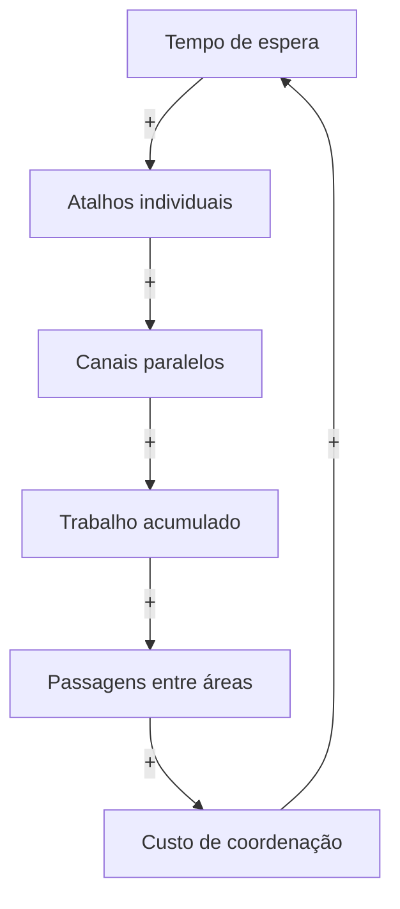

# O ciclo dos atalhos

Por que os atalhos podem aumentar a espera?

Quando o trabalho demora, cresce a pressão por resolver demandas por fora do
fluxo. O atalho pode aliviar um caso, mas sua repetição cria canais paralelos.
O trabalho se acumula, atravessa mais áreas e exige mais coordenação. A capacidade
gasta coordenando alonga a espera, que renova a pressão por atalhos.

## Relações

- e01 | espera | atalhos | ++ | Quanto maior a espera, maior a pressão por atalhos para resolver uma demanda.
- e02 | atalhos | canais | A repetição dos atalhos incentiva a abertura de canais paralelos de atendimento.
- e03 | canais | fila | Mais canais paralelos trazem demandas que se somam ao trabalho já acumulado.
- e04 | fila | passagens | Nesta situação, o trabalho acumulado aumenta as passagens e negociações entre áreas.
- e05 | passagens | coordenacao | Cada passagem entre áreas acrescenta alinhamentos e aumenta o custo de coordenação.
- e06 | coordenacao | espera | A coordenação ocupa capacidade de execução e alonga o tempo de espera.

## Ciclo

r1: e01, e02, e03, e04, e05, e06

